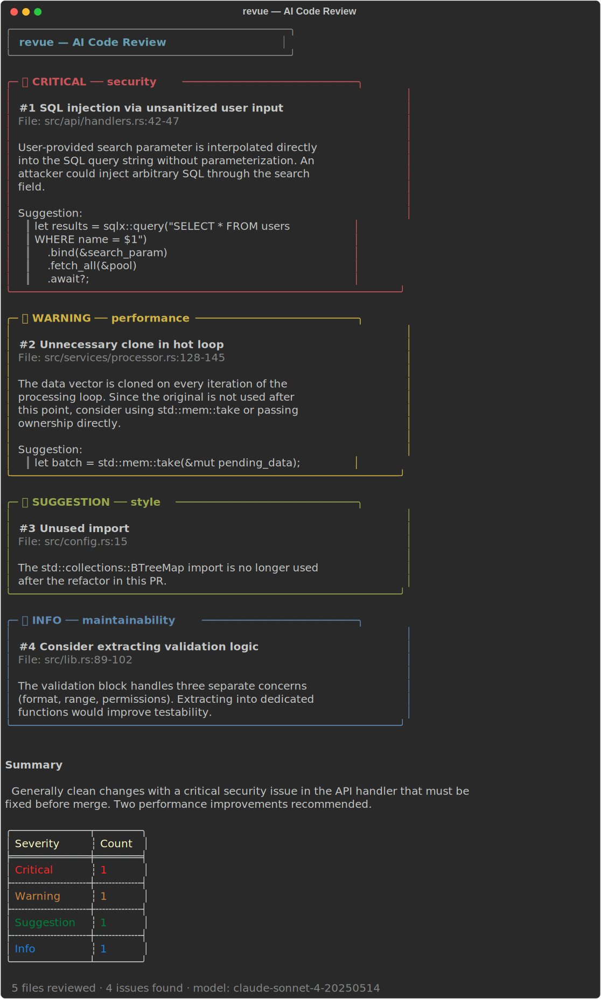

# revue

AI-powered code review CLI.

A Rust command-line tool that analyzes git diffs, builds repository context, and provides intelligent code review feedback using Claude. Detects security vulnerabilities, performance issues, bugs, and style problems with severity-graded output.



## Features

- Reviews staged changes or arbitrary commit ranges
- Builds repository context by reading related files and understanding imports, with token budgeting to stay within model limits
- Severity levels: Critical, Warning, Suggestion, Info -- with colored terminal output
- Configurable via `.revue.toml` (model, severity thresholds, ignore patterns)
- JSON output mode for CI integration
- Non-zero exit code on critical issues, suitable for pre-commit hooks and pipelines

## Tech Stack

Rust, Clap, git2, reqwest, rattles, owo-colors, comfy-table, tokio

## Installation

```
git clone https://github.com/kokinedo/revue.git
cd revue
cargo build --release
```

The binary will be at `target/release/revue`. Add it to your PATH or copy it somewhere convenient.

## Authentication

revue supports multiple AI providers. Use the built-in login flow:

```
revue login                       # default: Claude
revue login --provider openai     # OpenAI
revue login --provider gemini     # Google Gemini
```

This opens your browser to the provider's API key page, prompts you to paste the key, and stores it locally at `~/.config/revue/credentials.json`.

Alternatively, set environment variables:

```
export ANTHROPIC_API_KEY="your-key"   # Claude
export OPENAI_API_KEY="your-key"      # OpenAI
export GEMINI_API_KEY="your-key"      # Gemini
```

You can also set `api_key` in `.revue.toml` for per-repo configuration.

To remove stored credentials:

```
revue logout --provider claude
```

## Usage

Review staged changes:

```
revue
```

Review a commit range:

```
revue --commit HEAD~3..HEAD
```

Filter by minimum severity:

```
revue --severity warning
```

Use a different provider:

```
revue --provider openai
revue --provider gemini --model gemini-2.0-flash
```

Output as JSON (for CI):

```
revue --format json
```

Generate a default config file:

```
revue init
```

## Architecture

1. **Git diff extraction** -- uses git2 to read staged changes or a specified commit range
2. **Context building** -- identifies related files (imports, shared modules) and assembles context within a token budget
3. **Claude API review** -- sends the diff and context to Claude for analysis
4. **Terminal rendering** -- formats findings with severity colors, file locations, and explanations

## License

MIT
